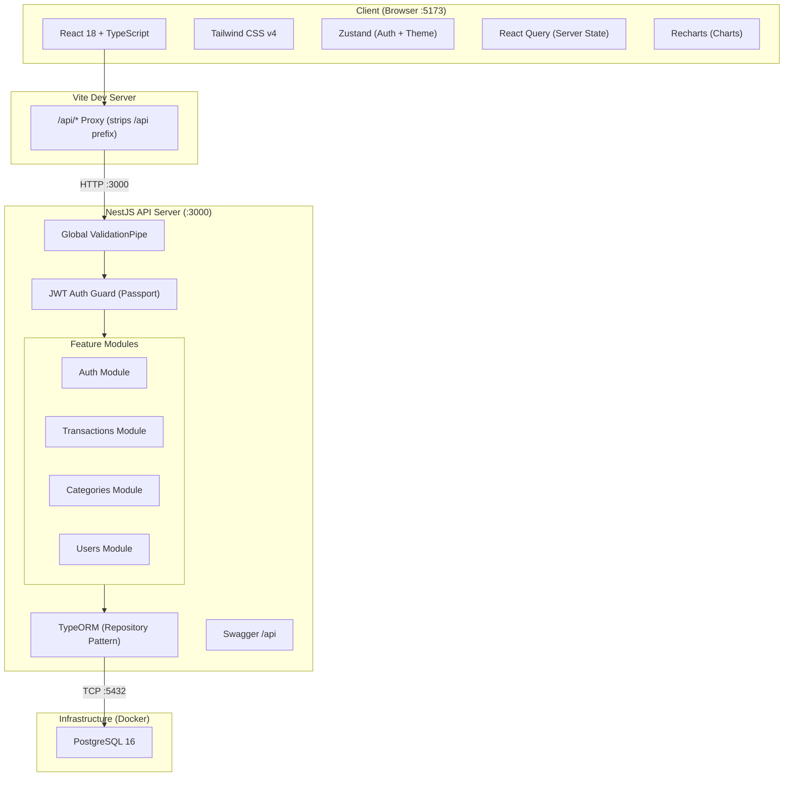
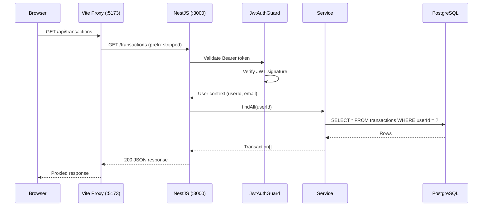
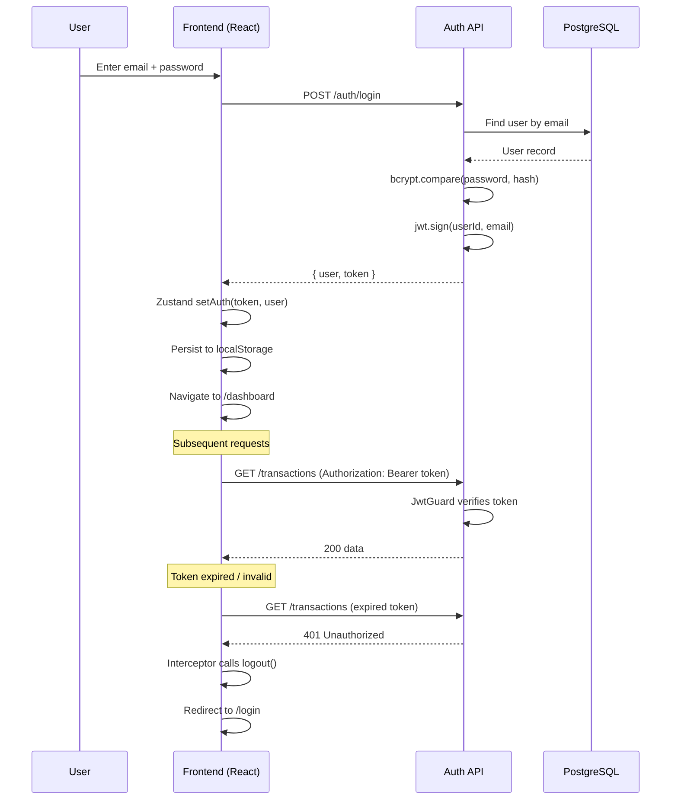
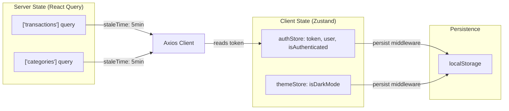
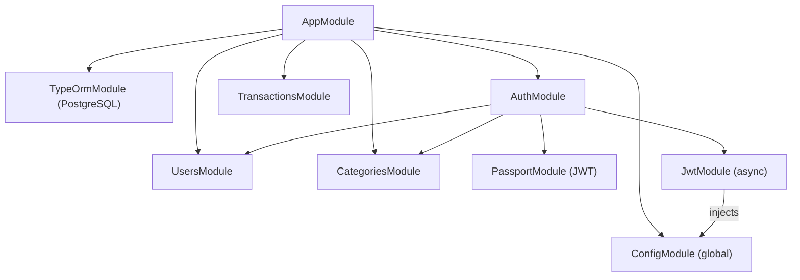
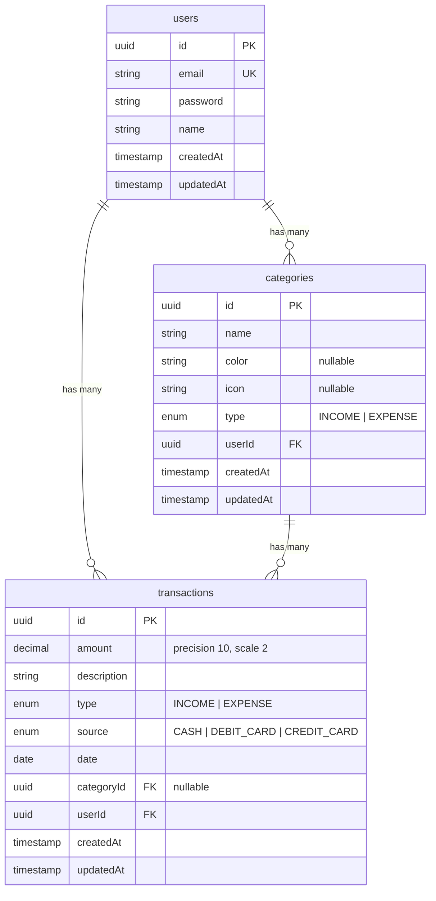
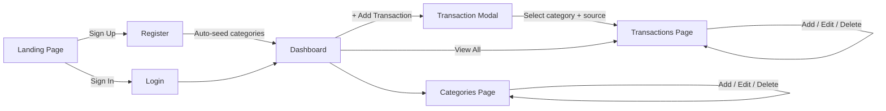

# SpendWise - Personal Finance Tracker

A full-stack personal finance management application for tracking income, expenses, and spending habits. Built with a modern TypeScript monorepo architecture using NestJS, React, and PostgreSQL.

**Repository:** https://github.com/SagarKarmoker/SpendWise-expense-tracker

## Table of Contents

- [System Architecture](#system-architecture)
- [Tech Stack](#tech-stack)
- [Data Model](#data-model)
- [API Reference](#api-reference)
- [Project Structure](#project-structure)
- [Getting Started](#getting-started)
- [Environment Variables](#environment-variables)
- [Features](#features)
- [Development](#development)
- [License](#license)

---

## System Architecture

### High-Level Overview



### Request Flow



### Authentication Flow



### Frontend State Management



### Module Dependency Graph



---

## Tech Stack

### Frontend (`apps/web`)

| Technology | Purpose |
|---|---|
| React 18 | UI framework |
| TypeScript | Type safety |
| Vite | Build tool and dev server |
| Tailwind CSS v4 | Utility-first styling |
| React Router v6 | Client-side routing with protected routes |
| Zustand | Client state management (auth, theme/dark mode) |
| TanStack React Query | Server state, caching, mutations |
| React Hook Form | Form handling and validation |
| Axios | HTTP client with interceptors |
| Recharts | Pie charts and bar charts |
| Lucide React | Icon library |

### Backend (`apps/api`)

| Technology | Purpose |
|---|---|
| NestJS 10 | Server framework (modular architecture) |
| TypeScript | Type safety |
| TypeORM | ORM with repository pattern |
| PostgreSQL 16 | Relational database |
| Passport + JWT | Authentication strategy |
| bcryptjs | Password hashing |
| class-validator | DTO validation (whitelist + transform) |
| Swagger / OpenAPI | Auto-generated API documentation |

### Infrastructure

| Technology | Purpose |
|---|---|
| Turborepo | Monorepo build orchestration |
| Docker Compose | PostgreSQL container |
| npm Workspaces | Dependency management across packages |

---

## Data Model

### Entity Relationship Diagram



### Relationships

- **User** `1:N` **Transaction** -- a user owns many transactions
- **User** `1:N` **Category** -- a user owns many categories (data isolation per user)
- **Category** `1:N` **Transaction** -- a category can have many transactions
- **Transaction** `N:1` **Category** -- a transaction optionally belongs to one category

### Enums

| Enum | Values |
|---|---|
| Transaction Type | `INCOME`, `EXPENSE` |
| Transaction Source | `CASH`, `DEBIT_CARD`, `CREDIT_CARD` |
| Category Type | `INCOME`, `EXPENSE` |

### User Journey



---

## API Reference

Base URL: `http://localhost:3000`

Swagger Docs: `http://localhost:3000/api`

### Authentication

| Method | Endpoint | Description | Auth |
|---|---|---|---|
| `POST` | `/auth/register` | Register new user (seeds default categories) | No |
| `POST` | `/auth/login` | Login, returns JWT token | No |

### Users

| Method | Endpoint | Description | Auth |
|---|---|---|---|
| `GET` | `/users/me` | Get current user profile | JWT |

### Transactions

| Method | Endpoint | Description | Auth |
|---|---|---|---|
| `GET` | `/transactions` | List all transactions (supports `?startDate&endDate`) | JWT |
| `GET` | `/transactions/:id` | Get transaction by ID | JWT |
| `POST` | `/transactions` | Create transaction | JWT |
| `PUT` | `/transactions/:id` | Update transaction | JWT |
| `DELETE` | `/transactions/:id` | Delete transaction | JWT |

**Create/Update Transaction Body:**

```json
{
  "amount": 150.00,
  "description": "Grocery shopping",
  "type": "EXPENSE",
  "source": "DEBIT_CARD",
  "date": "2026-02-07",
  "categoryId": "uuid-optional"
}
```

### Categories

| Method | Endpoint | Description | Auth |
|---|---|---|---|
| `GET` | `/categories` | List all categories for current user | JWT |
| `GET` | `/categories/:id` | Get category by ID | JWT |
| `POST` | `/categories` | Create category | JWT |
| `PUT` | `/categories/:id` | Update category | JWT |
| `DELETE` | `/categories/:id` | Delete category | JWT |

**Create/Update Category Body:**

```json
{
  "name": "Food & Dining",
  "color": "#FF5733",
  "icon": "utensils",
  "type": "EXPENSE"
}
```

---

## Project Structure

```
expense-tracker/
├── apps/
│   ├── api/                          # NestJS backend
│   │   ├── src/
│   │   │   ├── main.ts               # Bootstrap, CORS, Swagger, ValidationPipe
│   │   │   ├── app.module.ts          # Root module (Config, TypeORM, feature modules)
│   │   │   ├── auth/
│   │   │   │   ├── auth.module.ts     # JWT async registration, Passport
│   │   │   │   ├── auth.controller.ts # POST /auth/register, POST /auth/login
│   │   │   │   ├── auth.service.ts    # Registration (+ default categories), login, JWT
│   │   │   │   ├── jwt.strategy.ts    # Passport JWT strategy (Bearer token)
│   │   │   │   └── dto/index.ts       # LoginDto, RegisterDto, AuthResponse
│   │   │   ├── users/
│   │   │   │   ├── users.module.ts
│   │   │   │   ├── users.controller.ts # GET /users/me
│   │   │   │   ├── users.service.ts    # findByEmail, create
│   │   │   │   └── entities/
│   │   │   │       └── user.entity.ts
│   │   │   ├── transactions/
│   │   │   │   ├── transactions.module.ts
│   │   │   │   ├── transactions.controller.ts  # CRUD + date filtering
│   │   │   │   ├── transactions.service.ts     # CRUD + getSummary
│   │   │   │   ├── dto/index.ts
│   │   │   │   └── entities/
│   │   │   │       └── transaction.entity.ts
│   │   │   ├── categories/
│   │   │   │   ├── categories.module.ts
│   │   │   │   ├── categories.controller.ts    # CRUD
│   │   │   │   ├── categories.service.ts       # CRUD + createDefaults
│   │   │   │   ├── dto/index.ts
│   │   │   │   └── entities/
│   │   │   │       └── category.entity.ts
│   │   │   └── common/
│   │   │       └── guards/
│   │   │           └── jwt-auth.guard.ts       # Extends AuthGuard('jwt')
│   │   ├── .env.example
│   │   └── package.json
│   │
│   └── web/                          # React frontend
│       ├── src/
│       │   ├── main.tsx              # App entry, QueryClient, BrowserRouter
│       │   ├── App.tsx               # Route definitions (public + protected)
│       │   ├── index.css             # Global styles, Tailwind
│       │   ├── api/
│       │   │   ├── client.ts         # Axios instance, auth interceptor, 401 handler
│       │   │   ├── auth.ts           # login(), register()
│       │   │   ├── transactions.ts   # CRUD + types (Transaction, TransactionSource)
│       │   │   └── categories.ts     # CRUD + types (Category)
│       │   ├── components/
│       │   │   └── Layout.tsx        # Nav bar, dark mode toggle, user info, Outlet
│       │   ├── pages/
│       │   │   ├── LandingPage.tsx   # Public landing page
│       │   │   ├── Login.tsx         # Login form
│       │   │   ├── Register.tsx      # Registration form
│       │   │   ├── Dashboard.tsx     # Stats, charts (category pie, source bar), recent
│       │   │   ├── Transactions.tsx  # Transaction list, add/edit modal, source/category
│       │   │   └── Categories.tsx    # Category management (income/expense split)
│       │   └── stores/
│       │       ├── authStore.ts      # Zustand + persist (token, user, isAuthenticated)
│       │       └── themeStore.ts     # Zustand + persist (dark mode toggle)
│       ├── vite.config.ts            # Proxy /api → :3000, path alias
│       ├── .env.example
│       └── package.json
│
├── packages/
│   └── types/
│       └── src/index.ts              # Shared TypeScript interfaces
│
├── docker-compose.yml                # PostgreSQL 16
├── turbo.json                        # Turborepo pipeline config
└── package.json                      # Workspace root, scripts
```

---

## Getting Started

### Prerequisites

- **Node.js** >= 18
- **Docker** and **Docker Compose**
- **npm** (ships with Node.js)

### 1. Clone and Install

```bash
git clone <repository-url>
cd expense-tracker
npm install
```

### 2. Set Up Environment

```bash
# API environment
cp apps/api/.env.example apps/api/.env

# Web environment
cp apps/web/.env.example apps/web/.env
```

Edit `apps/api/.env` and set a strong `JWT_SECRET` for production.

### 3. Start the Database

```bash
npm run db:up
```

This starts PostgreSQL 16 via Docker Compose. The database schema is auto-synchronized in development mode via TypeORM.

### 4. Start Development Servers

```bash
npm run dev
```

Turborepo starts both the API and web servers in parallel:

| Service | URL |
|---|---|
| Frontend | http://localhost:5173 |
| Backend API | http://localhost:3000 |
| Swagger Docs | http://localhost:3000/api |

### 5. Create an Account

Open http://localhost:5173, click **Sign up**, and register. Default categories (8 expense + 4 income) are automatically created for your account.

---

## Environment Variables

### Backend (`apps/api/.env`)

| Variable | Default | Description |
|---|---|---|
| `DB_HOST` | `localhost` | PostgreSQL host |
| `DB_PORT` | `5432` | PostgreSQL port |
| `DB_USERNAME` | `spendtracker` | Database user |
| `DB_PASSWORD` | `spendtracker` | Database password |
| `DB_NAME` | `spendtracker` | Database name |
| `JWT_SECRET` | `your-super-secret-jwt-key...` | Secret for signing JWT tokens (change in production) |
| `FRONTEND_URL` | `http://localhost:5173` | Allowed CORS origin |
| `PORT` | `3000` | API server port |
| `NODE_ENV` | `development` | Environment (`development` enables DB sync + logging) |

### Frontend (`apps/web/.env`)

| Variable | Default | Description |
|---|---|---|
| `VITE_API_URL` | `http://localhost:3000` | API base URL (informational; proxy handles routing) |

---

## Features

### Dashboard
- Real-time balance, income, and expense totals from database
- Month-over-month percentage comparison (computed from actual data)
- Expense breakdown by category (pie chart with actual category colors)
- Spending by payment method (bar chart)
- Recent transactions list with source badges
- Personalized greeting with user name

### Transactions
- Full CRUD (create, read, update, delete)
- Filter by type (Income / Expense)
- Category assignment (auto-filtered by transaction type)
- Payment method tracking (Cash, Debit Card, Credit Card)
- Date picker
- Currency in Bangladeshi Taka (৳)

### Categories
- Separate income and expense category views
- Custom name, color, and icon per category
- Default categories seeded on registration
- Duplicate name prevention

### Authentication
- JWT-based authentication (7-day token expiry)
- Secure password hashing with bcrypt
- Persistent login via localStorage (Zustand persist middleware)
- Auto-logout on token expiration (401 interceptor)
- Protected routes with automatic redirect

### UI/UX
- Dark mode with system-aware toggle (persisted preference)
- Responsive design (mobile-first)
- Glassmorphism and modern card-based layout
- Smooth transitions and hover effects
- Loading spinners and empty states

---

## Development

### Available Scripts

| Command | Description |
|---|---|
| `npm run dev` | Start all dev servers (Turborepo) |
| `npm run build` | Build all packages |
| `npm run lint` | Lint all packages |
| `npm run typecheck` | Type-check all packages |
| `npm run db:up` | Start PostgreSQL container |
| `npm run db:down` | Stop and remove containers |

### API-Specific Scripts

```bash
cd apps/api
npm run dev          # Start with file watching
npm run build        # Compile to dist/
npm run test         # Run unit tests
npm run test:e2e     # Run end-to-end tests
```

### Web-Specific Scripts

```bash
cd apps/web
npm run dev          # Start Vite dev server
npm run build        # Type-check + production build
npm run preview      # Preview production build
```

---

## Production Deployment

### Docker Deployment (Recommended)

1. **Clone the repository:**
   ```bash
   git clone <repository-url>
   cd spendwise-expense-tracker
   ```

2. **Configure environment variables:**
   ```bash
   cp .env.example .env
   ```
   
   Edit `.env` and update the following for production:
   - `JWT_SECRET`: Generate a secure random string (use `openssl rand -base64 32`)
   - `DB_PASSWORD`: Use a strong database password
   - `DB_USER`: Change from default if desired
   - `NODE_ENV=production`

3. **Build and start services:**
   ```bash
   docker-compose up --build -d
   ```

4. **Verify deployment:**
   - Web App: http://localhost
   - API: http://localhost:3000
   - API Docs: http://localhost:3000/api

### Manual Deployment

#### Backend (API)

1. **Install dependencies:**
   ```bash
   cd apps/api
   npm install --production
   ```

2. **Set environment variables:**
   ```bash
   export NODE_ENV=production
   export DB_HOST=your-db-host
   export DB_PORT=5432
   export DB_USERNAME=your-db-user
   export DB_PASSWORD=your-secure-password
   export DB_NAME=spendtracker
   export JWT_SECRET=your-secure-jwt-secret
   export JWT_EXPIRATION=24h
   export PORT=3000
   ```

3. **Build and start:**
   ```bash
   npm run build
   npm start
   ```

#### Frontend (Web)

1. **Install dependencies:**
   ```bash
   cd apps/web
   npm install
   ```

2. **Build for production:**
   ```bash
   npm run build
   ```

3. **Serve static files** using nginx, Apache, or any static file server from the `dist/` folder.

### Production Checklist

- [ ] Change default database credentials
- [ ] Set a strong JWT_SECRET (minimum 32 characters)
- [ ] Configure firewall rules (only expose necessary ports)
- [ ] Set up SSL/TLS certificates
- [ ] Configure automated database backups
- [ ] Set up monitoring and logging
- [ ] Disable database synchronization in production (`synchronize: false`)
- [ ] Run database migrations instead of auto-sync
- [ ] Use environment-specific CORS settings

---

## License

MIT
